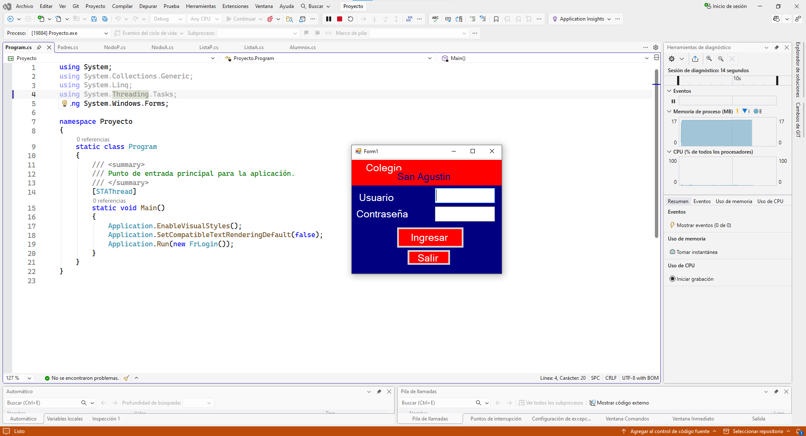
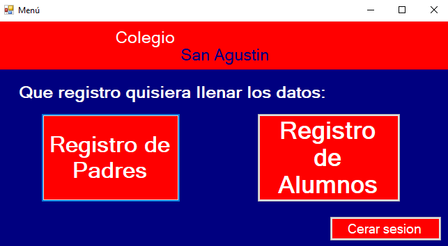
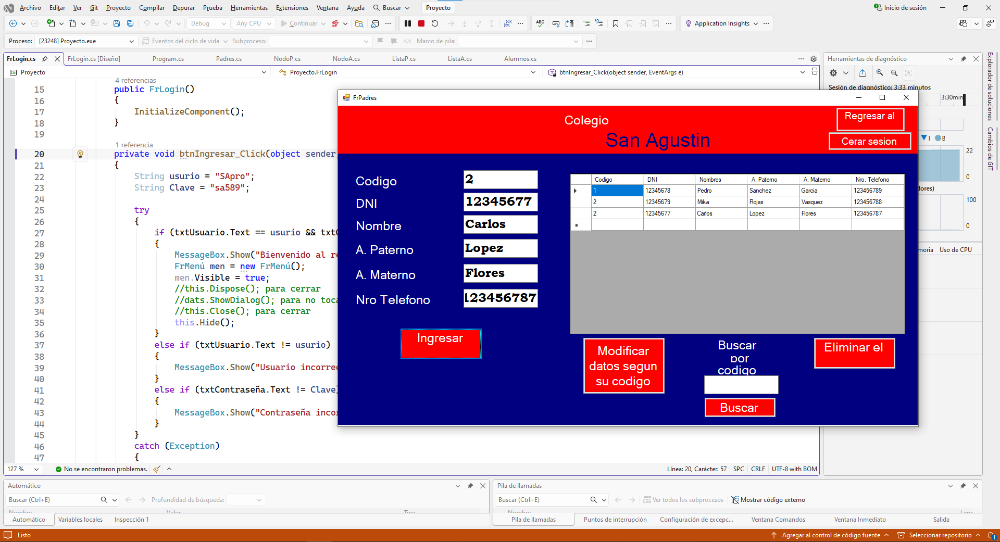
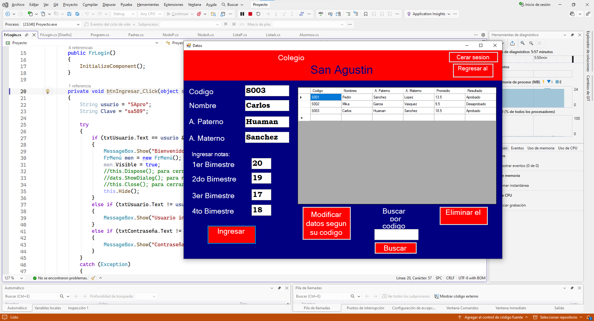

# Sistema de Registro de Alumnos
Aplicación desarrollada en C# que permite registrar alumnos, padres y notas bimestrales, utilizando estructuras de datos como listas enlazadas para gestionar la información y calcular promedios académicos.
---

## Tecnologías
* C#
* Windows Forms
* Visual Studio
* Estructuras de Datos (Listas Enlazadas)
---

## Funcionalidades
* Registro de alumnos y padres
* Ingreso de notas por bimestre
* Cálculo automático de promedio
* Visualización de datos en tablas (DataGridView)
* Uso de estructuras dinámicas (nodos y listas)
---

## Ejecución
1. Clonar el repositorio
2. Abrir el archivo `.sln` en Visual Studio
3. Ejecutar el proyecto
---

## Capturas del Sistema

### Pantalla Principal

### Menú del Sistema

### Registro de Padres

### Listado de Notas / Promedios

